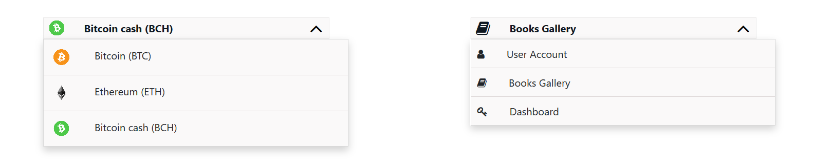

# jQuery Plugin IconSelectBox

# Objective
As a developer our objective is to make things easy. This jQuery plugin will help you to create custom select box with icon or images.



# Pre-requirements
    - jQuery  

# How to use
# Step 1 : 
Create select element with a unique `id`.
If you want to add images as an icon to `option list` then add image url to `data-icon` attribute otherwise assign `font-awesome icon class` to `data-icon` like in given example:

```HTML
	<select id="example" name="currency">
	  <option value="btc" data-icon="btc.png"> Bitcoin (BTC) </option>
	  <option value="eth" data-icon="eth.png"> Ethereum (ETH) </option>
	  <option value="bch" data-icon="bch.png"> Bitcoin cash (BCH) </option>
	</select>
```

# Step 2: 
Initialize the plugin like below:

```JavaScript
	$( selector ).IconSelectBox( isImage );
    // isImage: boolean;
```

To add image `isImage` should be `true` and for icons it should be `false`;


Finally you can get the value from your created `select element`.
like if you create element `#select-action` then you can get value like this 

```JavaScript
    $('#select-action').val();
```

Nothing complicated.
